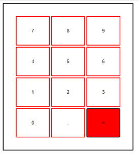

# Herhaling Javascript
## Oefening 1 - Totaal bedrag
- Maak een pagina oefening1.html met bijhorende script oefening1.js
- Vraag (via een prompt) eerst aan de gebruiker om een bedrag in te geven. 
- Vraag vervolgens om een BTW-percentage in te geven.
- Valideer de intput, toon een foutmelding indien de validatie niet slaagt.
- Bereken de verkoopprijs (= bedrag + btw) en toon deze in een alert

#### Extra
- Gebruik een loop zodat je de gebruiker om een bedrag vraagt en dit telkens herhaalt zolang de gebruiker een ongeldig bedrag in geeft. (tip: do-while)

## Oefening 2 - Gemiddelde
- Maak de bestanden oefening2.html en oefening2.js aan.
- Maak een array bikePrices aan die volgende prijzen bevat: 5329, 4999, 2499, 1999, 3750, 6415
- Maak een functie averagePrice() aan die de gemiddelde prijs van deze prijzen terug geeft. Toon vervolgens de volgende boodschap in de console van browser: 
    - “De gemiddelde prijs voor een fiets bedraagt ... euro.” 
    - Maak hiervoor gebruik van string interpolation.
    - Zorg ervoor dat het gemiddelde wordt getoond met 2 cijfers na de komma

## Oefening 3 - BTW-nummer
- Maak de bestanden oefening3.html en oefening3.js aan.
- Maak een formulier waarin de gebruiker een btw-nummer kan ingeven (text)
- Voorzie een knop (button) in het formulier
- Controleer na het drukken op de knop of het ingegeven nummer een geldig ondernemingsnummer is:
    - Een correct btw-nummer uit België begint met 'BE' + 0 + negen cijfers. 
    - Bereken de modulus van de eerste 8 cijfers (volgend op 'BE')
    - Bereken het verschil tussen 97 en deze modulus
    - Komt dit verschil overeen met de laatste 2 cijfers dan is dit een geldig ondernemingsnummer!
    - Meer info: [https://www.fiducial.be/nl/news/Hoe-kunt-u-weten-of-uw-klant-u-een-correct-BTW-nummer-gaf](https://www.fiducial.be/nl/news/Hoe-kunt-u-weten-of-uw-klant-u-een-correct-BTW-nummer-gaf)
- Toon het resultaat in een label van het formulier.

## Oefening 4 - Rekenmachine
- Maak de bestanden oefening4.html en oefening4.js aan.
- Voeg enkel 2 divisie elementen toe aan het html bestand
    
        

        

- Declareer in het script volgende array:

        let data = [[7,8,9],[4,5,6],[1,2,3],[0,”.”,”=”]];

- Het is de bedoeling dat je binnen het output-calculator element op een dynamische manier (met JavaScript) een tabel maakt van 4 rijen en 3 kolommen waarin elke cel een button voorstelt. 
- Doe dit op basis van de eerder gedefinieerde data array. 
- Voorzie eveneens de nodige styling zodat je volgend resultaat bekomt (bij een hover wijzigt de kleur van het element, de “=” knop is hier het voorbeeld van)

    

- Functioneel moet de rekenmachine getallen toevoegen aan een ongeordende lijst binnen het output-result element
- Wanneer je op één van de cijferknoppen klikt wordt het bijhorende cijfer bewaard in een variabele, wanneer op de '='-button geklikt wordt moet het gevormde getal toegevoegd worden als list-item aan de ongeordende lijst
- Zorg voor een verzorgde styling van de lijst ;-)

## Oefening 5 - Fietsen
- Maak in de map de bestanden oefening5.html en oefening5.js aan.
- Maak een lijst van 5 fiets objecten aan. Een fiets heeft volgende eigenschappen:
    - merk (string)
    - model (string)
    - prijs (number)
    - score (float)
- Gebruik volgende lijst als basis: https://www.anwb.nl/fiets/test/e-bike-test-2021
- Toon vervolgens alle fietsen met een prijs onder de €2500 in de console van de browser.